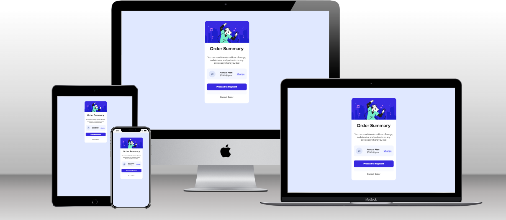

# Order-summary-component
Built out this responsive order summary card component with HTML5, CSS3. 

### The challenge

Users should be able to:

- View the optimal layout depending on their device's screen size
- See hover states for interactive elements

### Screenshot


### Links

- Solution URL: [Solution URL is here](https://github.com/Fatima-hub333/Order-summary-component.git)
- Live Site URL: [Live site URL is here](https://sparkling-muffin-af6b37.netlify.app)

## My process
I create html template first after that I started stylin components one by one.
### Built with

- Semantic HTML5 markup
- CSS custom properties
- Flexbox
- JavaScript ES6
- Mobile-first workflow

### What I learned

I learnt how can I add JavaScrit functionalities. It helps me alot in understanding eventlistener function of JS & how can we edit and modify website via DOM. 

## Getting Started
To get a local copy up and running, follow the steps in Setup below.

### Prerequisites
Basic knowledge of HTML, CSS.

### Setup
If you installed git you can clone the code to your machine, or download a ZIP of all the files directly.

[Download the ZIP from this location](https://github.com/Fatima-hub333/Order-summary-component/archive/refs/heads/main.zip), or run the following [git](https://git-scm.com/downloads) command to clone the files to your machine:

```bash
git clone https://github.com/Fatima-hub333/Order-summary-component.git
```

- Once the files are on your machine, open the _Portfolio_ folder in [Visual Studio Code](https://code.visualstudio.com/).

- With the files open in Visual Studio Code, press the **Go Live** button at the bottom of the window to launch the files with [Live Server](https://marketplace.visualstudio.com/items?itemName=ritwickdey.LiveServer).

### Install

The following tools help make easier to work with sample code.

- [git](https://git-scm.com/downloads): A tool for managing source code
- [Visual Studio Code](https://code.visualstudio.com/): A source code editor
- [Live Server](https://marketplace.visualstudio.com/items?itemName=ritwickdey.LiveServer): A simple web server utility for Visual Studio Code

## Authors

👤 **Fatima Zahir**

- GitHub: [@githubhandle](https://github.com/Fatima-hub333)
- Twitter: [@twitterhandle](https://twitter.com/Fatima_developr)
- LinkedIn: [LinkedIn](https://www.linkedin.com/in/fatimaa-zahir/)

## 🤝 Contributing

Contributions, issues, and feature requests are welcome!

Feel free to check the [issues page](https://github.com/Fatima-hub333/Order-summary-component/issues).

## Show your support

Give a ⭐️ if you like this project!


## 📝 License

This project is [MIT](./MIT.md) licensed.